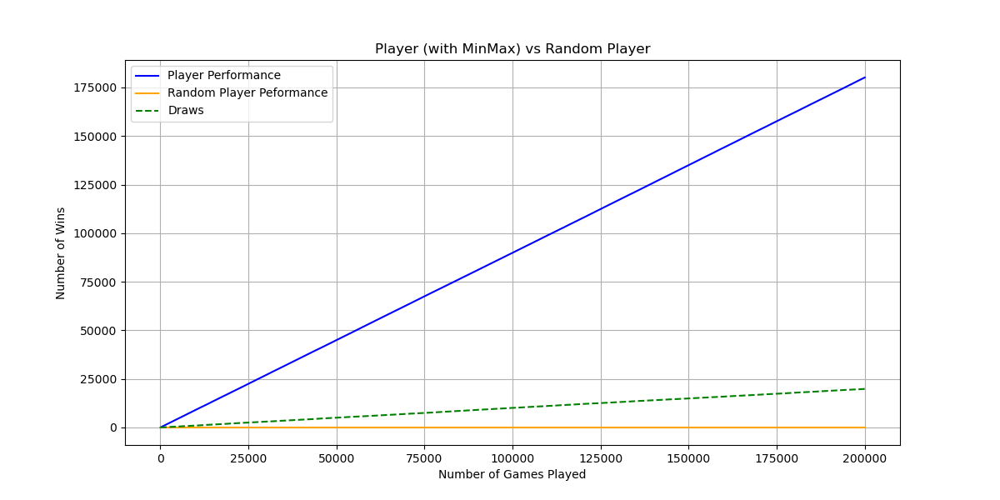
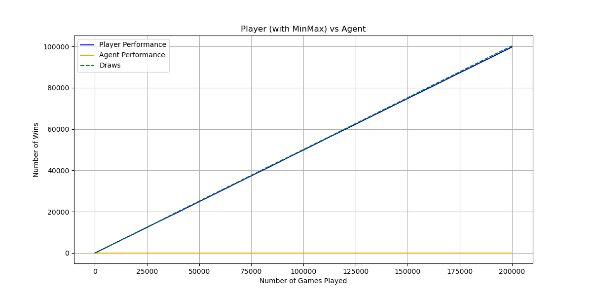

# Tic-Tac-Toe Reinforcement Learning with Q-Learning
Q-Learning agent that learns Tic-Tac-Toe strategy, improves via reward shaping, and approaches optimal play.

This project implements a Q-Learning agent to play Tic-Tac-Toe and evaluates how different training setups influence learning, strategy, and performance.
The focus is not only on playing the game, but on understanding what the agent learns, where it struggles, and how reward shaping improves decision-making.

## Project Goals
- Train a Q-learning agent for Tic-Tac-Toe
- Compare performance against different opponents
- Visualize Q-values and board preferences
- Examine RL limitations against an optimal (MinMax) opponent
- Enhance learning through reward shaping
- Build intuitive understanding of RL behavior in a simple, interpretable game

## Reinforcement Learning Setup
- **Algorithm:** Q-Learning
- **Exploration:** ε-greedy with decay
- **State Representation:** 3×3 Tic-Tac-Toe board (tabular)
- **Actions:** Valid cell placements (0–8)
- **Episodes:** 200,000 training games

## Experiments & Results
We followed a progressive experiment pipeline where each stage motivates the next.

### Baseline: MinMax vs Random Player
**Goal:** Establish a benchmark for optimal play.  
**Setup:** MinMax agent plays against a pure random player.
**Outcome:**  
- MinMax never loses  
- ~90% wins, ~10% draws, **0 losses**

**Takeaway:**
Tic-Tac-Toe is a solved game. MinMax represents the theoretical optimal strategy and sets the performance benchmark. Any learning agent should aim to at least avoid consistent losses against it.

**Results:** 


### Experiment 1: Q-Learning Agent vs Random Player

**Goal:** Test whether the RL agent can learn to consistently outperform a random opponent.  
**Setup:** Train agent vs random player for 200,000 games.  

**Outcome:**  
- Starts near ~40% win rate due to high exploration (ε = 1.0)  
- Gradually improves as ε decays and learning stabilizes 
- Achieves ~69% wins, ~20% losses, and ~10% draws after training.

**Takeaway:**  
The agent learns meaningful strategy and clearly outperforms a non-strategic opponent over time, confirming that Q-Learning is effective in this environment.

**Results:** 


### Experiment 2: Q-Learning Agent vs MinMax

**Goal:** Evaluate agent against perfect play.  
**Setup:** Same trained agent now faces MinMax.  
**Outcome:**  
- **0 wins**
- ~50% draws, ~50% losses  
- Flat learning curve, agent cannot improve further

**Takeaway:**  
Standard Q-Learning learns to avoid obvious mistakes but cannot discover optimal play without guidance. It survives occasionally but fails to plan ahead.

**Results:**  


### Experiment 3: Reward-Shaped Agent vs MinMax

**Goal:** Improve strategic learning using reward shaping.  
**Modification:** Added bonus reward for taking the center square on the first move.  
**Outcome:**  
- **0 losses across 200k games**
- 100% draws  
- Center square becomes consistently prioritized in Q-values

**Takeaway:**  
A small and targeted reward adjustment leads to a major strategic improvement.  
The agent learns strong defensive play and avoids losing entirely, reaching practical near-optimal performance.

**Results:**  


### Heatmaps: Board Preference Before vs After Reward Shaping

To analyze what the agent actually learned, we visualize Q-value heatmaps for key board states.

The agent was trained against a random player in both cases.  
The only difference is the reward function.

**Before reward shaping**
- Values are low and scattered
- No strong preference for center or optimal early moves
- Agent learns to win but without clear strategic focus

**After reward shaping (center bonus)**
- Strong, consistent preference for center square
- Much higher Q-values overall (stronger confidence)
- Moves become structured rather than random
- Behavior converges toward never losing against MinMax

These heatmaps show that even a small reward tweak leads to **more stable, strategic play**.

#### Visual Comparison (Before → After)

```

```

```

```

## Files Included

- `RL-TicTacToe.ipynb` — main notebook with training, evaluation, and visualizations
- `plots/` — contains plots and heatmaps used in README
- `README.md`

## How to Run

Open the notebook and run all cells:

1. Launch Jupyter / VS Code / Colab
2. Open `RL-TicTacToe.ipynb`
3. Run cells sequentially to train and evaluate the agent

## Summary of Results

| Experiment | Opponent | Training Setup | Final Results | Key Learning |
|-----------|---------|----------------|---------------|--------------|
| Baseline | MinMax vs Random | No learning (reference) | **MinMax:** ~90% wins, ~10% draws, **0 losses** | Establishes the optimal benchmark |
| Experiment 1 | Agent vs Random | Q-Learning, 200k games | **Agent:** ~69% wins, ~20% losses, ~10% draws | Agent learns winning patterns from scratch |
| Experiment 2 | Agent vs MinMax | Agent trained vs Random, then tested vs MinMax | **Agent:** 0 wins, ~50% losses, ~50% draws | Q-Learning alone cannot beat optimal play; limited long-term planning |
| Experiment 3 | Reward-Shaped Agent vs MinMax | Same training + bonus for first-move center | **Agent:** 0 losses, **100% draws** | Reward shaping teaches strategic behavior; agent never loses |


## What I Learned
- How Q-learning updates state-action values  
- Importance of ε-decay for exploration vs exploitation  
- Reward shaping can dramatically accelerate strategy learning  
- Tabular RL struggles with long-term planning vs perfect play  
- Visualizing Q-tables reveals agent intuition  

## Future Improvements
- Move from tabular Q-learning → **Deep Q-Network (DQN)**  
- Build interactive **UI to play against trained agent**
